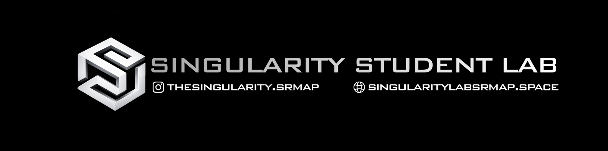

 

<!-- BANNER PLACEHOLDER — Replace with your LinkedIn-size banner (1584×396 px recommended) -->
<!--  -->

 

<h1>Singularity Student Lab</h1>
<h3>SRM University AP · Research-Driven. Frontier-Focused.</h3>

 

 

---

## About Us

Singularity Student Lab is a student-led research and innovation collective at **SRM University AP**, dedicated to pushing the boundaries of technology through interdisciplinary collaboration. We unite students across AI, Quantum Computing, Cybersecurity, Robotics, XR, and Blockchain under one research-driven ecosystem.

We believe innovation thrives at intersections — and we build at all of them.

 

<table>
<tr>
<td width="50%" valign="top">

### Our Vision
We aim to revolutionize the future of technology by driving groundbreaking research and fostering an environment where innovation knows no bounds. Through inclusive collaboration, we strive to create transformative solutions that bridge the gap between ideas and real-world impact.

</td>
<td width="50%" valign="top">

### Our Mission
To push the limits of technological advancement with cutting-edge tools and research-driven innovation. We are dedicated to knowledge sharing and empowering the next generation of tech leaders, ensuring a future where technology serves all.

</td>
</tr>
</table>

 

---

## Why Singularity?

| # | Capability | Description |
|---|-----------|-------------|
| `01` | **Learn by Doing** | We build, prototype, and explore real-world problems through research-driven projects, hackathons, and innovation sprints. |
| `02` | **Multi-Domain Labs** | Whether you're into AI, Quantum, Robotics, Cybersecurity, or AR/VR — there's a place for you. Cross-domain projects are encouraged and supported. |
| `03` | **Collaborate with the Best** | Work with passionate students, dedicated mentors, and industry leaders. We're supported by the Microsoft Student Community and growing partnerships every semester. |
| `04` | **Research with Impact** | From publishing papers to building MVPs — we incubate ideas that can evolve into startups, research publications, or community-focused solutions. |

 

---

## Our Labs

Six specialized labs. One unified mission.

 

### `01` — Prajna Kritrima Lab
**AI / ML · Deep Learning · Generative AI**

<!-- LAB LOGO PLACEHOLDER -->
<!--  -->

> *Prajna Kritrima — Sanskrit for Artificial Intelligence (Prajna = wisdom, Kritrima = man-made)*

The AI, ML, and Deep Learning wing of Singularity. We research neural architectures, generative models, and intelligent systems — from foundational theory to real-world deployment.

**Mission:** To advance artificial intelligence through innovative research in machine learning, deep learning, and generative AI — building systems that are powerful, ethical, explainable, and beneficial to society.

**Focus Areas**

**Executive Lead:** Surya Teja Batchu — *Deep Learning & Neural Networks*

 

---

### `02` — Aanu Tattva Lab
**Quantum Computing · Quantum Machine Learning**

<!-- LAB LOGO PLACEHOLDER -->
<!--  -->

> *Aanu Tattva — Sanskrit: Aanu (atom) + Tattva (principle/essence)*

The Quantum Computing division of Singularity. We explore qubits, entanglement, and quantum algorithms to decode the mysteries of the subatomic world — from theoretical foundations to quantum simulations.

**Mission:** To unlock the potential of quantum computing through groundbreaking research in quantum algorithms, quantum machine learning, and quantum error correction — developing practical solutions that provide exponential speedups over classical computing.

**Focus Areas**

**Executive Lead:** Jayanth Ramakrishnan — *Quantum Algorithms & ML · Founder*

 

---

### `03` — Chitra Darshan Lab
**Game Development · AR · VR · Mixed Reality**

<!-- LAB LOGO PLACEHOLDER -->
<!--  -->

> *Chitra Darshan — Sanskrit: "vision through imagery"*

The AR, VR, MR, and Game Development division. We craft virtual worlds, interactive experiences, and mixed reality applications that blur the line between the real and the digital — from gamified learning to futuristic simulations.

**Mission:** To revolutionize interactive entertainment and spatial computing through innovative game development, virtual reality, and augmented reality technologies — creating immersive experiences that engage, educate, and inspire.

**Focus Areas**

**Executive Lead:** Abir Banerjee — *Game Development & XR*

 

---

### `04` — Varahamihira Lab
**Cloud Computing · Cybersecurity**

<!-- LAB LOGO PLACEHOLDER -->
<!--  -->

> *Named after Varahamihira — the legendary astronomer and polymath*

The Cloud Computing and Cybersecurity division. We architect scalable cloud systems, fortify networks, and explore the art of digital defense — from deploying robust infrastructures to safeguarding cyberspace.

**Mission:** To advance cloud computing and cybersecurity through innovative research in scalable infrastructure, threat detection, and digital defense systems — architecting secure, efficient cloud solutions that protect critical systems.

**Focus Areas**

**Executives:**
- Poojan Patel — *Cloud Infrastructure · Executive Lead*
- Lokesh K — *LoRa & Communicative Networks · Executive*

 

---

### `05` — Bhaskaracharya Lab
**Blockchain · Web3 · Decentralized Systems**

<!-- LAB LOGO PLACEHOLDER -->
<!--  -->

> *Named after Bhaskaracharya — the legendary mathematician and astronomer*

The Blockchain and Web3 division. We build decentralized applications, cryptographic systems, and Web3-first digital experiences — where design meets logic and creativity meets code.

**Mission:** To advance blockchain technology through innovative research in threat detection, cryptographic systems, and decentralized applications — developing secure, privacy-preserving solutions that enable trustless interactions in the Web3 ecosystem.

**Focus Areas**

**Executive Lead:** Parvendan R — *Web Technologies & Web3*

 

---

### `06` — Agastya Lab
**Robotics · IoT · Embedded Systems · Drones**

<!-- LAB LOGO PLACEHOLDER -->
<!--  -->

> *Inspired by Agastya — the ancient sage known for wisdom and innovation*

The Robotics, IoT, and Drones division. We build smart systems, autonomous drones, and long-range IoT networks that bridge the physical and digital worlds — from sky to sensor.

**Mission:** To advance robotics, IoT, and embedded systems through innovative research in autonomous systems, smart sensors, and intelligent automation — developing practical solutions that enhance human capabilities and create sustainable smart environments.

**Focus Areas**

**Executive Lead:** Pradeep Chalamcharla — *Robotics & Autonomous Systems*

 

---

## An Optimistic Approach

We are building at the frontier — not just with technology, but with intent.

| Domain | Approach |
|--------|----------|
| **Quantum Horizons** | Quantum computing is reshaping cybersecurity, AI, and complex problem-solving. We provide tools for students to explore quantum algorithms and real-world applications. |
| **Decentralized Trust** | Web3 and blockchain technologies are redefining data ownership, transparency, and digital trust. We build decentralized applications that empower users and secure the internet of tomorrow. |
| **Immersive Realities** | By bridging the physical and digital worlds through Mixed Reality (XR), we are creating intuitive, spatial experiences that transform how we learn, interact, and solve problems. |
| **Inclusive Progress** | With low-code and no-code platforms, we enable students from all backgrounds to develop solutions without deep programming expertise. Empowering non-tech innovators is key to our mission. |

 

---

## Connect

 

---

**Singularity Student Lab** · SRM University AP · Amaravati, Andhra Pradesh, India

*Founded by [Jayanth Ramakrishnan](https://github.com/jayanthoffl)*

Decode // Innovate // Transform

